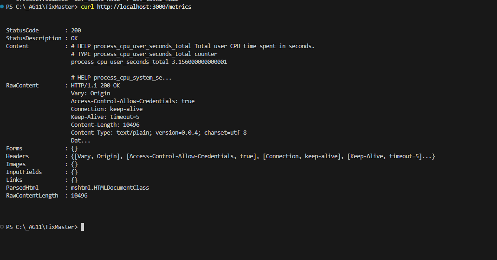
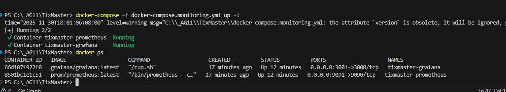

# 🚀 TixMaster 監控系統完整設定指南

## 📋 目錄
1. [系統架構](#系統架構)
2. [啟動步驟](#啟動步驟)
3. [儀表板設計說明](#儀表板設計說明)
4. [測試監控系統](#測試監控系統)
5. [疑難排解](#疑難排解)

---

## 🏗️ 系統架構

```
┌─────────────────┐
│   使用者請求     │
└────────┬────────┘
         │
         ▼
┌─────────────────────────┐
│  TixMaster Backend      │
│  (Port 3000)            │
│  - Express.js           │
│  - Metrics Middleware   │
│  - /metrics endpoint    │
└────────┬────────────────┘
         │
         │ HTTP GET /metrics (每 10 秒)
         ▼
┌─────────────────────────┐
│  Prometheus             │
│  (Port 9091)            │
│  - 收集 Metrics         │
│  - 時間序列資料庫       │
│  - PromQL 查詢引擎      │
└────────┬────────────────┘
         │
         │ PromQL 查詢
         ▼
┌─────────────────────────┐
│  Grafana                │
│  (Port 3001)            │
│  - 視覺化儀表板         │
│  - 即時圖表             │
│  - 警報系統             │
└─────────────────────────┘
```

---

## 🚀 啟動步驟

### 步驟 1: 啟動 Backend Server

```bash
cd backend
npm start
```

**驗證**:
```bash
curl http://localhost:3000/metrics
```

你應該會看到 Prometheus 格式的 metrics 輸出。



### 步驟 2: 啟動 Docker Desktop

確保 Docker Desktop 正在運行（Windows 系統托盤應該有 Docker 圖示）。

### 步驟 3: 啟動監控系統

在專案根目錄執行：

```bash
docker-compose -f docker-compose.monitoring.yml up -d
```

**這會啟動**:
- ✅ Prometheus 容器 (port 9091)
- ✅ Grafana 容器 (port 3001)

**驗證**:
```bash
docker ps
```

你應該會看到兩個容器正在運行：
- `tixmaster-prometheus`
- `tixmaster-grafana`

### 步驟 4: 存取監控系統

**Prometheus UI**:
- URL: http://localhost:9091
- 檢查 Status → Targets
- `tixmaster-backend` 應該顯示 **UP** (綠色)

**Grafana UI**:
- URL: http://localhost:3001
- Username: `admin`
- Password: `admin`

---

## 🎨 儀表板設計說明

### 📐 整體設計理念

我們的儀表板遵循 **Golden Signals** 監控理念：

1. **Latency (延遲)** - 請求回應時間
2. **Traffic (流量)** - 請求率
3. **Errors (錯誤)** - 錯誤率
4. **Saturation (飽和度)** - 資源使用率

### 🎯 儀表板佈局 (Grid Layout)

```
┌──────────────────────────────────────────────────────┐
│  第一排 - 系統健康度快速檢視                          │
├────────────┬────────────┬──────────────────────────┤
│ CPU 使用率  │ 記憶體使用  │   HTTP 請求率 (時序圖)    │
│  (Gauge)   │  (Gauge)   │   (Line Chart)          │
│   6 欄     │   6 欄     │      12 欄              │
└────────────┴────────────┴──────────────────────────┘

┌──────────────────────────────────────────────────────┐
│  第二排 - 效能與錯誤追蹤                              │
├──────────────────────────┬──────────────────────────┤
│ HTTP 回應時間 (P50/P95)   │   HTTP 錯誤率 (4xx/5xx)  │
│  (Time Series)           │   (Stacked Area)        │
│      12 欄               │      12 欄              │
└──────────────────────────┴──────────────────────────┘

┌──────────────────────────────────────────────────────┐
│  第三排 - 請求統計與分析                              │
├────────────┬────────────┬──────────────────────────┤
│ 活躍請求數  │ 總請求數    │  HTTP 狀態碼分佈         │
│  (Gauge)   │  (Stat)    │  (Pie Chart)            │
│   6 欄     │   6 欄     │      12 欄              │
└────────────┴────────────┴──────────────────────────┘
```

### 🎨 視覺設計原則

#### 1. **顏色語意學**

| 顏色 | 意義 | 使用場景 |
|------|------|----------|
| 🟢 綠色 | 正常 | CPU < 80%, 記憶體正常, 無錯誤 |
| 🟡 黃色 | 警告 | CPU 80-90%, 記憶體偏高, 4xx 錯誤 |
| 🔴 紅色 | 危險 | CPU > 90%, 記憶體爆滿, 5xx 錯誤 |
| 🔵 藍色 | 資訊 | 一般趨勢圖, 中性數據 |

#### 2. **圖表類型選擇**

| 圖表類型 | 用途 | 優點 |
|---------|------|------|
| **Gauge** | 即時數值 | 一眼看出當前狀態 |
| **Time Series** | 趨勢追蹤 | 觀察歷史變化 |
| **Stat** | 總計數值 | 突出重要指標 |
| **Pie Chart** | 比例分佈 | 直觀的百分比顯示 |

#### 3. **資訊層次**

```
優先級 1 (最上方)：快速健康檢查
  → CPU, 記憶體, 即時流量

優先級 2 (中間)：效能深入分析
  → 回應時間百分位數, 錯誤趨勢

優先級 3 (下方)：詳細統計
  → 活躍請求, 總請求數, 狀態碼分佈
```

### 📊 各 Panel 詳細說明

#### Panel 1: CPU 使用率 (Gauge)

**PromQL 查詢**:
```promql
100 * (1 - avg(rate(process_cpu_user_seconds_total[5m])))
```

**閾值設定**:
- 綠色: 0-80%
- 紅色: 80-100%

#### Panel 2: 記憶體使用量 (Gauge)

**PromQL 查詢**:
```promql
process_resident_memory_bytes
```

**閾值設定**:
- 綠色: < 50MB
- 黃色: 50-100MB
- 紅色: > 100MB

#### Panel 3: HTTP 請求率 (Time Series)

**PromQL 查詢**:
```promql
sum(rate(http_requests_total[1m])) by (route, method)
```

**顯示**:
- 圖例位置: 底部表格
- 顯示數值: Mean, Max
- 分組: 依 route 和 method

#### Panel 4: HTTP 回應時間 (Time Series)

**PromQL 查詢**:
```promql
# P95 (95th percentile)
histogram_quantile(0.95, sum(rate(http_request_duration_ms_bucket[5m])) by (le, route))

# P50 (median)
histogram_quantile(0.50, sum(rate(http_request_duration_ms_bucket[5m])) by (le, route))
```

**解釋**:
- P50: 50% 的請求回應時間
- P95: 95% 的請求回應時間
- 如果 P95 很高，代表有部分請求很慢

#### Panel 5: HTTP 錯誤率 (Time Series)

**PromQL 查詢**:
```promql
# 5xx 錯誤率
100 * sum(rate(http_errors_total{status_code=~"5.."}[5m])) / sum(rate(http_requests_total[5m]))

# 4xx 錯誤率
100 * sum(rate(http_errors_total{status_code=~"4.."}[5m])) / sum(rate(http_requests_total[5m]))
```

**視覺化**:
- 堆疊面積圖
- 5xx = 紅色 (伺服器錯誤)
- 4xx = 黃色 (客戶端錯誤)

#### Panel 6: 活躍請求數 (Gauge)

**PromQL 查詢**:
```promql
http_requests_active
```

**用途**: 監控即時的並發請求數

#### Panel 7: 總請求數 (Stat)

**PromQL 查詢**:
```promql
sum(increase(http_requests_total[1h]))
```

**顯示**: 過去 1 小時的總請求數

#### Panel 8: HTTP 狀態碼分佈 (Pie Chart)

**PromQL 查詢**:
```promql
sum(increase(http_requests_total[1h])) by (status_code)
```

**顯示**: 各狀態碼的比例分佈

### ⚙️ 儀表板全域設定

**時間範圍**: 最近 30 分鐘
```json
{
  "from": "now-30m",
  "to": "now"
}
```

**自動刷新**: 每 5 秒
```json
{
  "refresh": "5s"
}
```

**深色主題**: 專業、護眼
```bash
GF_USERS_DEFAULT_THEME=dark
```

---

## 🧪 測試監控系統

### 測試 1: 基本請求

```bash
# 產生正常請求
curl http://localhost:3000/health
curl http://localhost:3000/api/events
```

**預期結果**:
- HTTP 請求率上升
- 回應時間被記錄
- 總請求數增加

### 測試 2: 產生錯誤

```bash
# 404 錯誤
curl http://localhost:3000/api/nonexistent

# 多個錯誤
for i in {1..10}; do
  curl http://localhost:3000/api/fake-endpoint
done
```

**預期結果**:
- 錯誤率圖表出現黃色區域
- 狀態碼圓餅圖顯示 404
- http_errors_total counter 增加

### 測試 3: 壓力測試

```bash
# 產生 100 個並發請求
for i in {1..100}; do
  curl http://localhost:3000/health &
done
```

**預期結果**:
- 活躍請求數暴增
- HTTP 請求率飆升
- 回應時間可能變長

### 測試 4: 觀察 Crash API

```bash
# 觸發伺服器當機
curl -X POST http://localhost:3000/api/crash
```

**預期結果**:
- Prometheus Targets 頁面顯示 `tixmaster-backend` 變成 **DOWN**
- Grafana 儀表板停止更新
- 重啟 backend 後，數據恢復

---

## 🛠️ 疑難排解

### 問題 1: Prometheus 顯示 Target DOWN

**可能原因**:
- Backend 沒有運行
- Backend 運行在錯誤的 port
- Docker 無法連接到主機

**解決方案**:
```bash
# 1. 檢查 backend 是否運行
curl http://localhost:3000/metrics

# 2. 檢查 Docker 容器網路
docker logs tixmaster-prometheus

# 3. 在 Windows/Mac 上確認使用 host.docker.internal
# prometheus.yml 應該包含:
targets: ['host.docker.internal:3000']
```

### 問題 2: Grafana 沒有資料

**檢查清單**:
1. ✅ Prometheus 是否正在收集數據？
   - 前往 http://localhost:9091/graph
   - 執行查詢: `http_requests_total`
   - 應該會看到數據

2. ✅ Grafana 資料源是否正確？
   - Configuration → Data Sources
   - Prometheus URL 應該是 `http://prometheus:9090`

3. ✅ 產生一些流量
   ```bash
   curl http://localhost:3000/health
   ```

### 問題 3: 儀表板沒有自動載入

**解決方案**:
```bash
# 重啟 Grafana
docker-compose -f docker-compose.monitoring.yml restart grafana

# 或手動匯入 dashboard
# 1. Grafana UI → Dashboards → Import
# 2. 上傳 grafana/dashboards/tixmaster-overview.json
```

---

## 📚 進階配置

### 修改 Prometheus 抓取間隔

編輯 `prometheus.yml`:
```yaml
scrape_configs:
  - job_name: 'tixmaster-backend'
    scrape_interval: 5s  # 從 10s 改為 5s
```

重新載入:
```bash
# 方法 1: 重啟容器
docker-compose -f docker-compose.monitoring.yml restart prometheus

# 方法 2: 熱重載 (需要 --web.enable-lifecycle)
curl -X POST http://localhost:9091/-/reload
```

### 自訂儀表板

1. 在 Grafana UI 中編輯儀表板
2. 點擊 "Save dashboard"
3. 匯出 JSON:
   - Dashboard settings → JSON Model
   - 複製 JSON
   - 儲存到 `grafana/dashboards/`

---

## 🎯 Phase 5 完成檢查清單

- [x] ✅ Prometheus 配置檔建立
- [x] ✅ Docker Compose 配置完成
- [x] ✅ Grafana 自動配置 (provisioning)
- [x] ✅ 儀表板 JSON 設計完成
- [x] ✅ 8 個 Panel 全部實作
- [x] ✅ 顏色配置與閾值設定
- [x] ✅ 深色主題
- [x] ✅ 自動刷新 (5 秒)
- [x] ✅ 測試指南撰寫
- [x] ✅ 疑難排解文件

---

## 🚀 啟動完整監控系統

**一鍵啟動**:
```bash
# 終端機 1: 啟動 Backend
cd backend && npm start

# 終端機 2: 啟動監控系統
docker-compose -f docker-compose.monitoring.yml up -d

# 終端機 3: 產生測試流量
for i in {1..50}; do curl http://localhost:3000/health && sleep 1; done
```

**存取點**:
- 🎯 Backend: http://localhost:3000
- 📊 Metrics: http://localhost:3000/metrics
- 🔍 Prometheus: http://localhost:9091
- 📈 Grafana: http://localhost:3001

---

**下一步**: Phase 6 - 系統架構圖 🏗️
