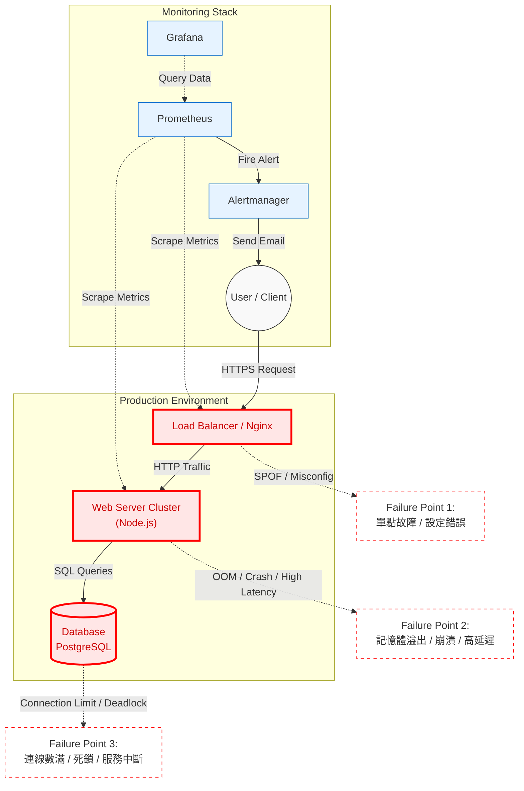

# OPS-03 服務地圖 (Service Map) 與系統架構圖

本文件展示 TixMaster 的系統架構與流量流向，並標示潛在的單點故障 (SPOF) 與風險點。

## 系統架構圖 (System Architecture Diagram)

下圖描述了使用者請求如何流經各個元件，以及監控系統如何介入。

## 潛在故障點分析 (Failure Points Analysis)

圖中以 **紅色邊框** 標示的元件代表關鍵故障點，需特別關注其監控指標：

### 1. Load Balancer (負載平衡器)

* **風險**: 若此節點掛掉，所有流量將無法進入系統 (Single Point of Failure)。
* **監控指標**: Uptime, Active Connections, 5xx Error Rate。
* **緩解**: 使用雲端 LB (AWS ALB/GCP LB) 或設定 High Availability (Keepalived)。

### 2. Web Server (應用伺服器)

* **風險**: 程式碼 Bug 導致崩潰、記憶體洩漏 (Memory Leak)、高併發導致 Event Loop 阻塞。
* **監控指標**: CPU Usage, Memory Usage, HTTP Response Time, Error Rate。
* **緩解**: 設定自動重啟 (PM2/K8s Liveness Probe)、水平擴展 (Auto-scaling)。

### 3. Database (資料庫)

* **風險**: 連線數耗盡 (Connection Pool Exhaustion)、慢查詢 (Slow Query) 拖垮效能、死鎖 (Deadlock)。
* **監控指標**: Active Connections, Query Duration, Lock Wait Time。
* **緩解**: 使用 Connection Pooling (PgBouncer)、讀寫分離、定期優化索引。

---

文件建立日期: 2025-12-01
