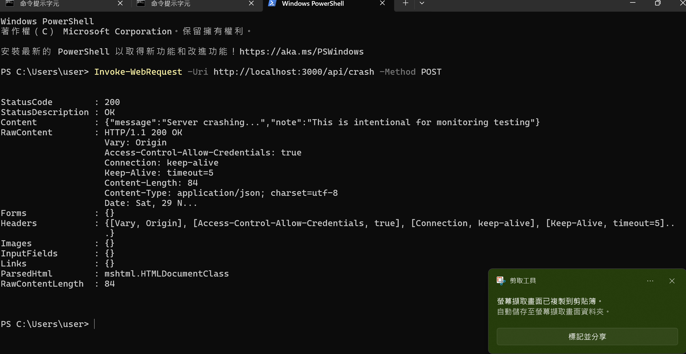

# **任務 1 — 可觀測性：Logs 與 Metrics（Achieving）**

學生需完成：

- 確保應用與環境能產生 **日誌（logs）**、**指標（metrics）**，及可選的 **追蹤（traces）**。
- 整合任一收集方式，例如：
    - **終端機式檢視工具：** kubectl logs、docker logs、自製 CLI
    - **圖形化儀表板：** Grafana、Kibana、Prometheus UI、Elastic APM、自訂 Dashboard

需提供以下截圖：

- 日誌內容（log entries）
- 指標（CPU、記憶體、延遲、請求率、錯誤率等）

並需解釋可觀測性的設定如何提升系統可靠性。

## **2. 開發者（Developer）**

專注於程式儀表化、logging 與可復原性。

需完成：

- 實作應用日誌（建議採用 structured logs）與明確的 severity levels。
- 實作指標（Prometheus counters/gauges/histograms 或自訂 metrics）。
- 建立簡易儀表板或終端介面來顯示 logs/metrics。
- 加入警報或閾值（即使為模擬亦可）。
- 撰寫符合 SLI/SLO/SLA 的開發策略文件。
- 說明程式中關於 logging 格式、correlation IDs、錯誤處理策略的設計選擇。

--- 

@昱辰
修改後端程式碼，確保 Log。要包含 Level (Info/Error), Timestamp, UserID。JSON 格式
寫一支 API /api/crash，一呼叫這支 API，伺服器就要故意當機
規劃一下 Grafana 或監控畫面的排版，讓它看起來直觀、漂亮

---

## 📋 任務 1 執行清單

### Phase 1: 後端日誌系統建置
- [x] 安裝 logging 套件（winston 或 pino）
- [x] 設定結構化日誌格式（JSON）
  - [x] Level (Info/Error/Warning)
  - [x] Timestamp
  - [x] UserID（如有登入）
  - [x] Request ID
- [x] 修改所有 API 端點加入日誌
- [ ] 測試日誌輸出是否正確

### Phase 2: Crash API 實作
- [x] 建立 `/api/crash` 端點
- [x] 實作伺服器當機邏輯
- [x] 測試 API 是否能正確觸發當機

### Phase 3: Metrics 收集
- [ ] 安裝 Prometheus client 套件
- [ ] 建立 `/metrics` 端點
- [ ] 實作以下 metrics:
  - [ ] HTTP 請求總數（counter）
  - [ ] HTTP 請求延遲（histogram）
  - [ ] 活躍請求數（gauge）
  - [ ] 錯誤率（counter）

### Phase 4: 監控系統設定
- [ ] 安裝 Prometheus
- [ ] 設定 Prometheus scrape targets
- [ ] 安裝 Grafana
- [ ] 建立 Grafana dashboard
  - [ ] CPU 使用率
  - [ ] 記憶體使用率
  - [ ] HTTP 請求率
  - [ ] 回應時間
  - [ ] 錯誤率

### Phase 5: 儀表板設計
- [ ] 規劃 Grafana 儀表板排版
- [ ] 設計視覺化圖表
- [ ] 調整顏色與主題
- [ ] 確保直觀易讀

### Phase 6: 系統架構圖
- [ ] 繪製系統架構圖
  - [ ] Frontend → Backend
  - [ ] Backend → Database
  - [ ] 監控系統連線
- [ ] 標示可能斷線的點

### Phase 7: 警報設定
- [ ] 設定 Alertmanager
- [ ] 建立警報規則（5xx 錯誤、Timeout）
- [ ] 設定 Email 通知
- [ ] 測試警報觸發

### Phase 8: SLI/SLO/SLA 文件
- [ ] 定義 SLI（可用性、延遲、錯誤率）
- [ ] 定義 SLO（目標值）
- [ ] 撰寫開發策略文件
  - [ ] Logging 格式說明
  - [ ] Correlation ID 使用
  - [ ] 錯誤處理策略

### Phase 9: RUNBOOK 撰寫
- [ ] 撰寫故障排除手冊
  - [ ] 5xx 錯誤處理
  - [ ] Timeout 處理
  - [ ] DB 連線失敗處理
- [ ] 撰寫 SOP 具體指令

### Phase 10: 測試與截圖
- [ ] 截圖：日誌內容（JSON 格式）
- [ ] 截圖：Grafana 儀表板
- [ ] 截圖：Prometheus metrics
- [ ] 截圖：警報通知
- [ ] 測試 DDOS 攻擊情境
- [ ] 使用 RUNBOOK 實際操作

### Phase 11: 文件整理
- [ ] 整理所有截圖
- [ ] 完成系統架構圖
- [ ] 完成 SLI/SLO/SLA 文件
- [ ] 完成 RUNBOOK
- [ ] 撰寫可觀測性提升系統可靠性的說明

### Phase 12: 最終驗收
- [ ] 完整測試所有功能
- [ ] 準備 Demo
- [ ] 提交報告
